---
# Residuals and Diagnostics For linear regression Using R

viwe on on rpub [Residuals and Diagnostics For linear regression](https://rpubs.com/Amrabdelhamed611/669768)

Residuals and Diagnostics plots are tools to spot problems on the model will use some simulations and R data package to illustrate how to generate diagnostics plots and how to interpret them.

* **Linear model:**   .
* **Predicted value:** 
* **Residuals:** 
* **Residual variation:** .

to evaluate the model fitting and residuals of a linear model generated by R, we can use the plot(model) to produce a series of 4 diagnostic plots:

*	**Residuals vs fitted values:** plots ordinary residuals vs fitted values used to detect patterns for missing variables, heteroscedasticity, etc.
*	**Scale Location:** plots standardized residuals vs fitted values similar residual plot, used to detect patterns in residuals.
*	**Normal Q-Q:** plots theoretical quantities for standard normal vs actual quantities of standardized residuals used to evaluate normality of the errors.
*	**Residuals vs Leverage:** plots cooks distances comparison of fit at that point vs potential for influence of that point used to detect any points that have substantial influence on the regression model.

Regression analysis since regression based on certain assumptions. Regression diagnostics used to evaluate the model assumptions and investigate whether or not there are observations with a large, undue influence on the analysis. Again, the assumptions for linear regression are:

*	**Linearity**: The relationship between X and the mean of Y is linear.
*	**Homoscedasticity**: The variance of residual is the same for any value of X.
*	**Independence**: Observations are independent of each other.
*	**Normality**: For any fixed value of X, Y is normally distributed.

### **Residuals vs fitted values plots**

The fitted vs residuals plot is mainly useful for investigating:

* if linearity assumptions holds: This is indicated by the mean residual value for every fitted value region being close to 0.this is shown by the red line is approximate to the dashed line in the graph.
* if homoskedasticity assumptions holds. if spread of residuals is approximately the same across the
x-axis.
* if data contain outlines This indicated by some ‘extreme’ residuals that are far from the other residuals points.

simulated Example:polynomial function To illustrate how violations of linearity.

```r
x=rnorm(1:500)
y=1+x+x^2+x^3 
plot(lm(y~x),which = 1)
```

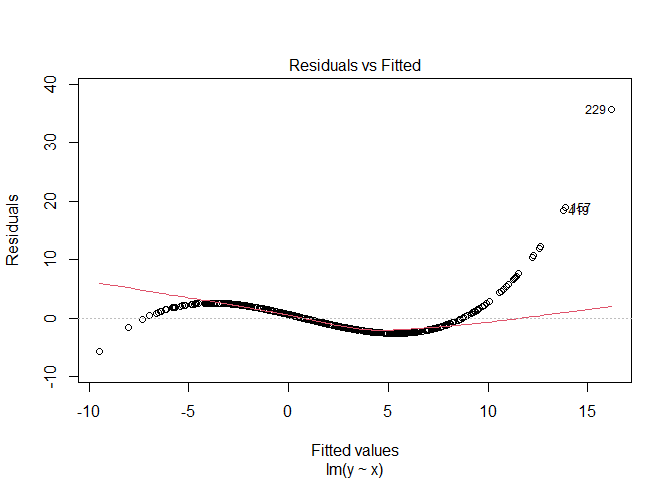<!-- -->

we can see the pattern in the graph so that indicate the data violations of linearity.
the y equation is 3rd order polynomial function. if the relationship between x and y is non-linear, the residuals will be a non-linear function of the fitted values.

simulated Example: linear function

we know Speed = distance / time so using mtcars data from R to plot the residuals of distance as dependent variable and the speed the out come to see the linear residuals.

```r
data("cars")
model <- lm(dist~speed,data=cars)
plot(model,which = 1)
```

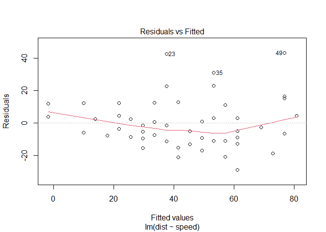<!-- -->

linearity seems to hold, as the red line is close to the dashed line. and the heteroskedasticity as we move to the right on the x-axis, the spread of the residuals seems to be increasing. 
notice the points 23, 35, and 49 they far from the data may be outliers, as they has large residual values.

### **The Scale Location Plot**

The scale-location plot is very similar to residuals vs fitted, but plot the square root Standardized residuals vs fitted values to verify homoskedasticity assumption.We want to look at:

* **the red line:** the red line represent the average the standardized residuals.and must be approximately horizontal.if the line approximately horizontal and magnitude of the line hasn’t much fluctuations in the line ,that means the average of the standardized residuals approximately same.
* **variance around the line:** The spread of standardized residuals around the red line doesn’t vary with respect to the fitted values,means the variance of standardized residuals due to each fitted value is approximately the same not much fluctuations in the variance.

we can also verify our finding by using bptest from lmtest library,the bptest function test the hypothesis of homoskedasticity by check the p-value of the test we can verify our finding normly if the p-value less then .05 we reject the hypothesis.

**Example with mtcars data**: but not include all predictors to get violation for homoskedasticity assumption.

```r
modelmt <- lm(disp ~ cyl + hp  ,data= mtcars)
plot(modelmt,which = 3)
```

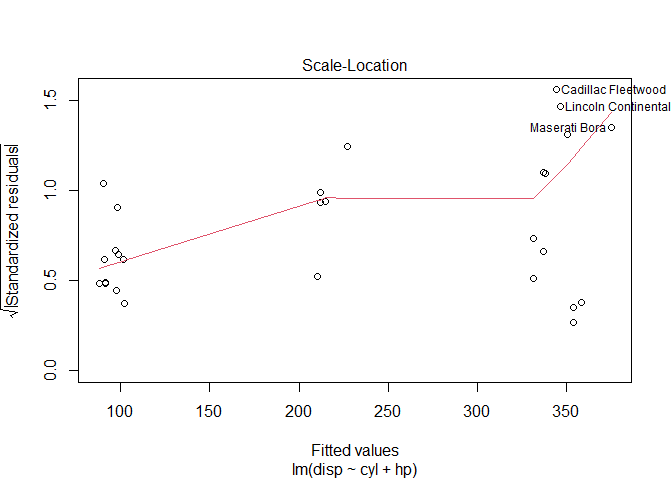<!-- -->

at this plot the red line is raising not horizontal line means the average is not approximately constant, only constant for the fitted values around 210 to 340 and for other values the average increasing that violation for homoskedasticity assumption.

```r
bptest(modelmt)
```

```
## 
## 	studentized Breusch-Pagan test
## 
## data:  modelmt
## BP = 6.1726, df = 2, p-value = 0.04567
```
the p-value is less then .05 so the assumption of homoskedasticity is violated as we expected.

**Simulated example with polynomial function**: 

```r
x=1:200
y= 4*x + x^2 + x^4 
modelpoly <- lm(y~x)
plot(modelpoly ,which = 3)
```

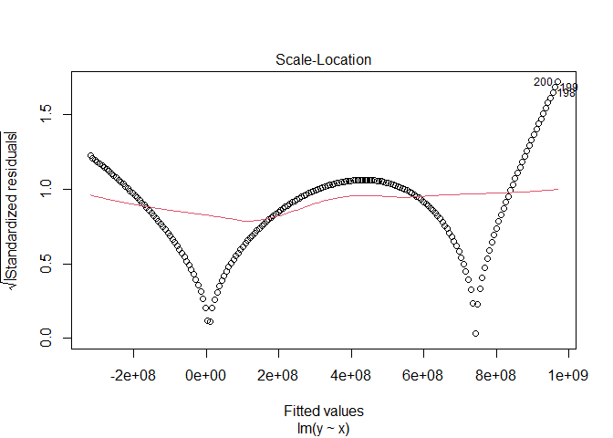<!-- -->

at this plot the red line is approximately constant, but the variance around the line changing that also violation for homoskedasticity assumption. 

```r
bptest(modelpoly )
```

```
## 
## 	studentized Breusch-Pagan test
## 
## data:  modelpoly
## BP = 26.561, df = 1, p-value = 2.553e-07
```
also p-value is less then .05 so the assumption of homoskedasticity is violated as we expected.

### **The normal QQ Plot in Linear Regression**
The Q-Q plot, or quantile-quantile plot, is a graphical tool to help us assess if a set of data plausibly came from some theoretical distribution such as a Normal or exponential. For example, if we run a statistical analysis that assumes our dependent variable is Normally distributed, we can use a Normal Q-Q plot to check that assumption. It’s just a visual check, not an air-tight proof, so it is somewhat subjective. But it allows us to see at-a-glance if our assumption is plausible, and if not, how the assumption is violated and what data points contribute to the violation.
A Q-Q plot is a scatterplot created by plotting two sets of quantities against one another. If both sets of quantiles came from the same distribution, we should see the points forming a line that’s roughly straight if not the residuals considered Gaussian (normal) IID.

**example with swiss data**: 

```r
data("swiss")
modelsw <- lm(Fertility ~.,data=swiss)
plot(modelsw ,which = 2)
```

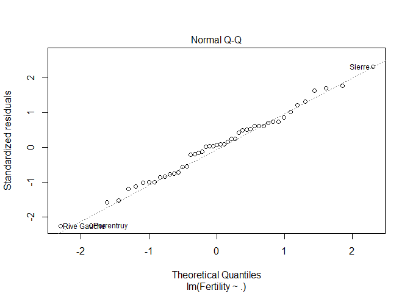<!-- -->

Gaussian (normal) IID values fall 99.7% of values between there standard deviations quantities. 
so to the quantities of standardized residuals theoretically must match the quantities of standardized normal that the dash line in the plot.

in the plot the data points seems to be approximately forming a line that’s roughly straight so that verify the assumption of the residual is a Gaussian (normal) IID.

can check the distribution of the residuals by another plots the PDF and CDF of the residuals.

```r
resdulpdf<-density(modelsw$residuals)
plot(resdulpdf,main='Residual pdf shape Plot',xlab='Residuals')
```

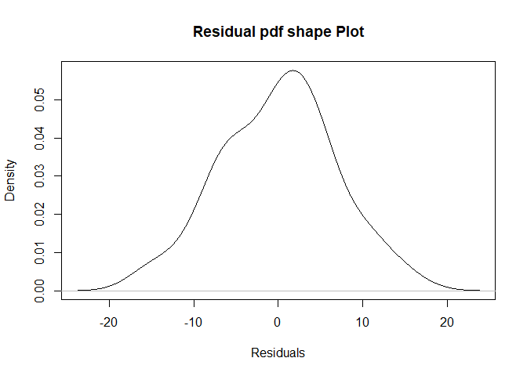<!-- -->

the shape of the probability density function is approximately bell shaped

```r
resdulcdf <- ecdf(modelsw$residuals)
plot(resdulcdf,main='Residuals cdf ',xlab='Residuals')
```

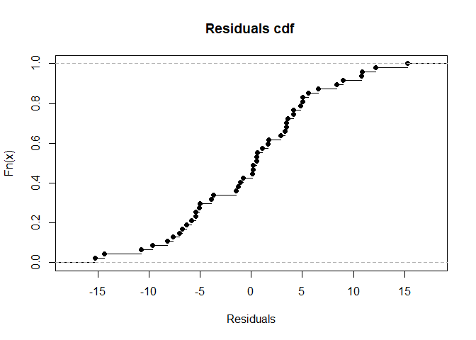<!-- -->

the CDF values in Gaussian (normal) IID summation equals one and must centered around the mean as known the residuals mean equals zero as in the plot and the plot approximately symmetric around the mean and the check x-axis the range from -15 to 15 .

### **Residuals vs Leverage**
The Residuals vs. Leverage plots helps to identify influential data points on the model. outliers can be influential, though they don’t necessarily have to it and some points within a normal range in your model could be very influential.

*	**Outliers**: defined as an observation that has a large residual. In other words, the observed value for the point is very different from that predicted by the regression model.
*	**Leverage observations**: defined as an observation that has a value of x that is far away from the mean of x. 
*	**Influential observations**: defined as an observation that changes the slope of the line. Thus, influential points have a large influence on the fit of the model. One method to find influential points is to compare the fit of the model with and without each observation.

to convey those points will simulate some examples in the follow examples:

* x,y correlated data generated randomly 
* xout,yout the data contain Outlier that added to x,y
* then plot the data , the mean of x ,and two fitted lines.
* orange data points in the plot are the Outliers
* the red regression line associated with data without the outliers.
* the blue regression line associated with data contain the outliers.

**Example:** of data point with low Leverage and low Influence.

```r
#low lav low inf
x =c(.5*(1 :30) +.7*rnorm(30)) #x without_outlier
y =2+ x + 1.2*rnorm(30) #y without_outlier
xout =c(x,17) #x with_outlier
yout =c(y,19) #y with_outlier
plot(xout , yout) 
points(x = 17,y =19 ,col= "orange", lwd =2)
abline(v = mean(x) , col = "purple3",lwd = 3) #the mean vertical line
abline(lm(y ~ x), col = "Red")  #outlier is not included in regression line 
abline( lm(yout ~ xout), col = "Blue") #outlier is included in regression line 
points(x = 17,y =19 ,col= "orange", lwd =2)
```

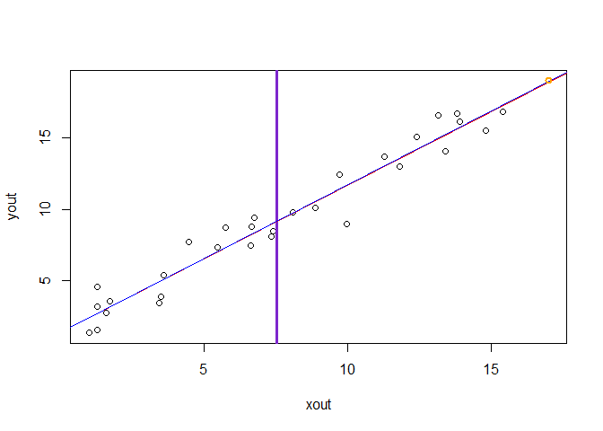<!-- -->

from the plot: the outlier is close to the mean so it has low leverage and so low influence. because, the two fitted regression lines has the same slopes so that conform the low influence. 


```r
#HL lI
x1=.5* (1:30) +.5*rnorm(30) #without_outlier
y1=2+ x1 + 1.2*rnorm(30) #without_outlier
xout1 =c(x1,22) #with_outlier
yout1 =c(y1,24) #with_outlier
plot(xout1 , yout1) 
points(x = 22,y =24 ,col= "orange", lwd =2)
abline(v = mean(x1) , col = "purple3",lwd = 3) #the mean vertical line
abline(lm(y1 ~ x1), col = "Red")  #outlier is not included in regression line 
abline( lm(yout1 ~ xout1), col = "Blue") #outlier is included in regression line 
```

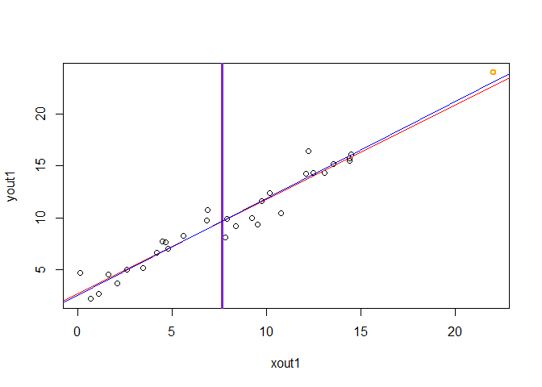<!-- -->

from the plot: the outlier is far from the mean so it has high leverage but low influence. because, the two fitted regression lines has the same slopes so that conform the low influence.


```r
x2=.2* (1:30) +.5*rnorm(30) #without_outlier
y2=2+ x2 + 1.2*rnorm(30) #without_outlier
xout2 =c(x2,9,10) #with_outlier
yout2 =c(y2,14,16) #with_outlier
plot(xout2 , yout2) 
points(x = c(9,10),y =c(14,16) ,col= "orange", lwd =2)
abline(v = mean(x2) , col = "purple3",lwd = 3) #the mean vertical line
abline(lm(y2 ~ x2), col = "Red")  #outlier is not included in regression line 
abline( lm(yout2 ~ xout2), col = "Blue") #outlier is included in regression line 
```

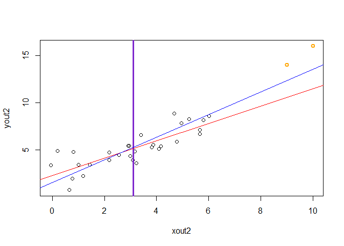<!-- -->

from the plot: the outliers is far from the mean so it has high leverage and high influence. because, the two fitted regression lines has a different slopes so that conform the low influence.
we can use Residuals vs. Leverage to verfy that:

```r
plot(lm(yout2 ~ xout2),which=5)
```

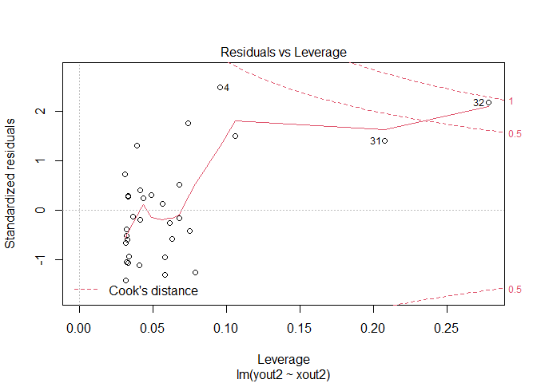<!-- -->

the two outliers in the plot appears with values on x-axis grater then the all data.we see that points that have high residual and high leverage. The points that lie close to or outside of the dashed red curves are worth investigating further but as these simulated data so we know those the outliers added to the data.
the red dashed line represents cook's distances above 0.5 , 1 so let look to cook's distances plot too see cook's distances of the outliers.


```r
plot(lm(yout2 ~ xout2),which=4)
```

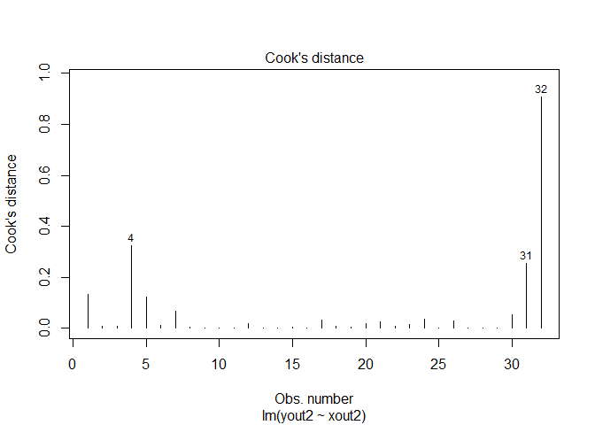<!-- -->

from the plot we see the outliers point 32 ,31 with  0.6 ,and 0.2 cook's distances ,that was the expected as in previous plot Residuals vs. Leverage the point 32 has high leverage and was above the red dash line with 0.5 cook's distance.


### References

[Boostedml linear and generalized linear  models](https://boostedml.com/category/linear-and-generalized-linear-models)

[cran.r-project Residual Diagnostics](https://cran.r-project.org/web/packages/olsrr/vignettes/residual_diagnostics.html)

[Regression Models by Johns Hopkins University on coursera](https://www.coursera.org/learn/regression-models)

